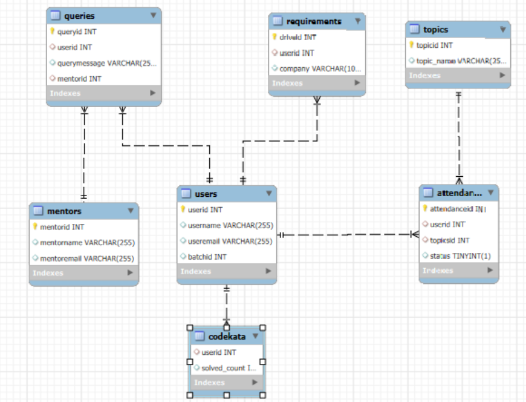

# Day-30 Task

This Repo contains my MySQL Day-2 Task

<b>Task Q</b>: Design DB model for Guvi Zen class

1. Contains SQL Script in <<Day-2_Task>>
2. Contains SQL ERR Diagram in <<Task_DB_Model>>

Here is the snapshot for your referance:

